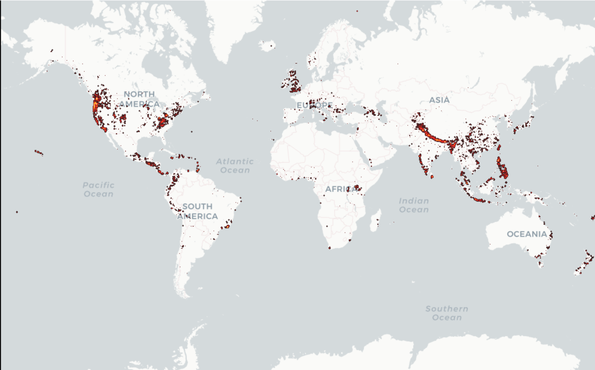

# Geoplot-landslides
Custom layer demo for geoplotlib using public worldwide landslide data

## Getting Started

Run the Landslides.ipynb notebook.

The ouputs should be the following :

Dynamic map of landslides over time:


Density of landslides map:


### Installation
```
pip install -r requirements.txt
```

## Authors

* **Antoine Sueur**
